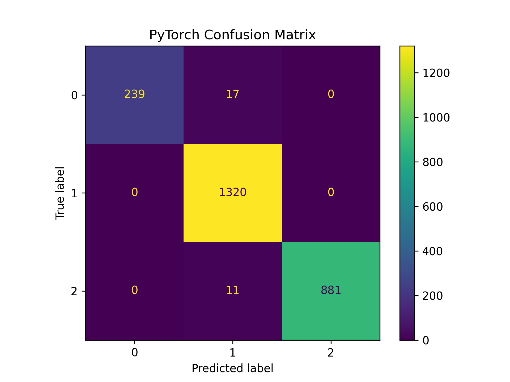
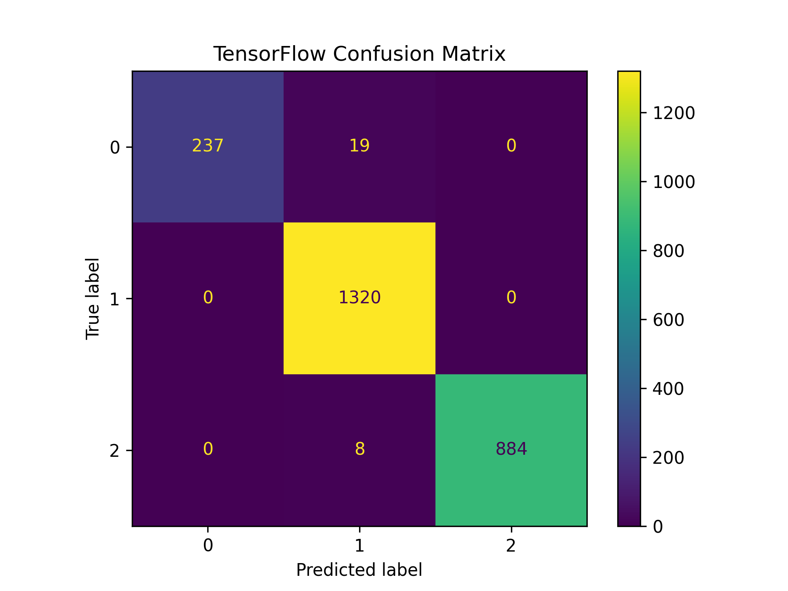

# 🧬 DeepVariant PyTorch Implementation

[](https://www.python.org/downloads/release/python-31012/)
[](https://pytorch.org/)
[](https://www.tensorflow.org/)
[](https://opensource.org/licenses/MIT)

> A deep learning-based variant caller implemented in PyTorch

## 📋 Table of Contents
- [Data Sources](#data-sources)
- [Directory Structure](#directory-structure)
- [Installation](#installation)
- [Usage](#usage)
- [Results](#results)
- [Future Development Plans](#future-development-plans)

## 📊 Data Sources

All data required for this project can be found in Google Cloud Storage. Below are the specific locations and instructions for downloading and organizing the data:

> **Note**: All data from Google Cloud Storage is subject to the original DeepVariant license terms. See the [NOTICE](NOTICE) file for details.

### 🔄 Model Checkpoints
The WGS (Whole Genome Sequencing) model checkpoints can be downloaded from:
```
https://console.cloud.google.com/storage/browser/deepvariant/models/DeepVariant/1.8.0/checkpoints/wgs
```

**Organization**: Place all downloaded checkpoint files in the `./data/tf_model` directory.

### 🧪 Test Data
Test data for validation can be downloaded from:
```
https://console.cloud.google.com/storage/browser/deepvariant/training-case-study/BGISEQ-HG001/1.8.0/customized_training/
```

The validation set files follow the pattern: `validation_set.with_label.tfrecord-XXXXX-of-00024.gz`

> **Note**: You can download just one file for testing. Let's use [validation_set.with_label.tfrecord-00000-of-00024.gz](https://console.cloud.google.com/storage/browser/_details/deepvariant/training-case-study/BGISEQ-HG001/1.8.0/customized_training/validation_set.with_label.tfrecord-00000-of-00024.gz) as an example.

**Organization**: Place all test data files in the `./data/test` directory.

### 🔍 Additional Resources
Almost all DeepVariant-related data can be found in the main storage bucket:

[https://console.cloud.google.com/storage/browser/deepvariant](https://console.cloud.google.com/storage/browser/deepvariant)

## 📁 Directory Structure
After downloading, your data directory should be organized as follows:
```
.
├── data
│   ├── py_model
│   │   └── deepvariant.pt # transformed from TensorFlow model
│   ├── test
│   │   └── validation_set.with_label.tfrecord-00000-of-00024.gz
│   └── tf_model
│       ├── deepvariant.wgs.ckpt.data-00000-of-00001
│       ├── deepvariant.wgs.ckpt.index
│       └── example_info.json
```

## 🔧 Installation

### Install uv
Use [uv](https://docs.astral.sh/uv/getting-started/installation/) to manage dependencies:

### Install Dependencies
```bash
uv sync
```

## 🚀 Usage

### Convert TensorFlow Model to PyTorch
```bash
uv run python tf2pytorch.py --weights ./data/tf_model/deepvariant.wgs.ckpt --output ./data/pt_model/deepvariant.pt
```

### Run PyTorch Model and TensorFlow Model
```bash
uv run python inference.py
```

## 📈 Results

The model produces the following classification metrics:

### PyTorch Model Performance
```
              precision    recall  f1-score   support
           0     1.0000    0.9258    0.9615       256
           1     0.9800    1.0000    0.9899      1320
           2     1.0000    0.9910    0.9955       892
    accuracy                         0.9891      2468
   macro avg     0.9933    0.9723    0.9823      2468
weighted avg     0.9893    0.9891    0.9890      2468
```

### TensorFlow Model Performance
```
              precision    recall  f1-score   support
           0     1.0000    0.9258    0.9615       256
           1     0.9800    1.0000    0.9899      1320
           2     1.0000    0.9910    0.9955       892
    accuracy                         0.9891      2468
   macro avg     0.9933    0.9723    0.9823      2468
weighted avg     0.9893    0.9891    0.9890      2468
```

### Confusion Matrices

<div align="center">
  <p><strong>PyTorch Confusion Matrix</strong></p>
  
  
  <p><strong>TensorFlow Confusion Matrix</strong></p>
  
</div>

## 🔮 Future Development Plans

The current implementation focuses on model conversion and inference. Future development will expand the project's capabilities in the following areas:

### 🧠 Training Functionality

- **Custom Training Pipeline**: Implement a complete PyTorch training pipeline to fine-tune the model on new datasets.

- **Transfer Learning**: Add support for transfer learning from pre-trained models to adapt to different sequencing platforms or variant types.

- **Distributed Training**: Implement multi-GPU and distributed training support for large-scale genomic datasets.

### 🔍 Data Preprocessing

- **Direct PyTorch Data Format**: Develop utilities to convert genomic data (BAM, VCF) directly to PyTorch-compatible formats, bypassing the TFRecord intermediate step currently required by the official model.

- **Data Augmentation**: Implement genomic data augmentation techniques to improve model robustness.

- **Quality Control**: Add quality control metrics and filtering for input genomic data.

## 🤝 Contributing

Contributions are welcome! Please feel free to submit a Pull Request.

## 📄 License

This project is licensed under the MIT License - see the [LICENSE](LICENSE) file for details.

### ⚠️ Important License Notice

**Please note**: While this PyTorch implementation is licensed under MIT, the original DeepVariant model, checkpoints, and data are subject to Google's BSD 3-Clause license. When using the original DeepVariant resources, you must comply with their license terms.

See the [NOTICE](NOTICE) file for complete details about the original DeepVariant license and how it applies to components used in this project.
