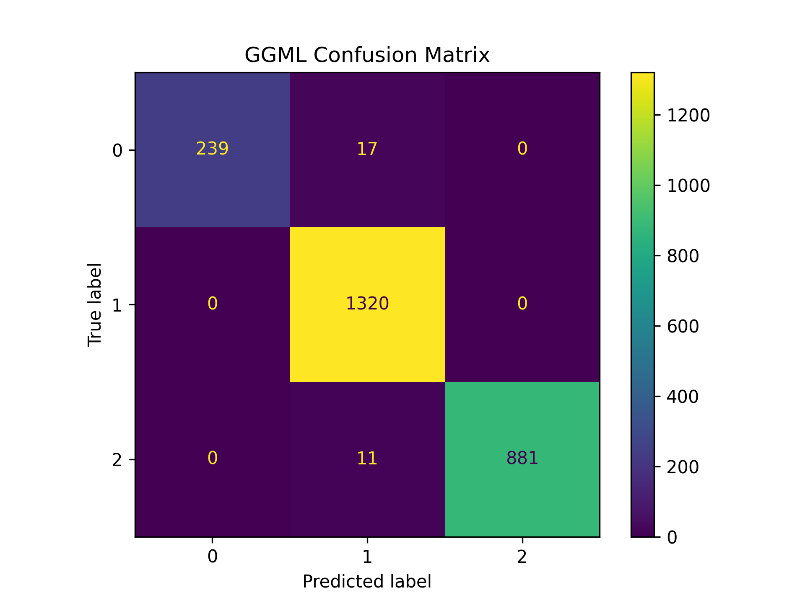

# Run deepvariant.cpp

## 🔄 Convert h5 to gguf model
```bash
uv run python tf2gguf.py --weights ./data/tf_model/deepvariant.wgs.ckpt --output ./data/gguf_model/deepvariant.gguf
```

## 🔨 Build C++ GGML with pybind11
```bash
mkdir -p ggml_model/build && cd ggml_model/build
cmake -DPYTHON_VERSION=3.10 -DBUILD_TESTS=ON  # set your python version, cmake will cache ggml and pybind11 automatically
make -j8
```
Run GGML test usage
```bash
# ./bin/test_inception3 <model-path> [batch-size] [loop-conut]
./bin/test_inception3 ../../data/gguf_model/deepvariant.gguf
```
Run python bindings test usage
```bash
# python ../test/test_inception3_bindings.py <model-path> [batch-size]
python ../test/test_inception3_bindings.py ../../data/gguf_model/deepvariant.gguf
```

## 🧪 Inference GGML Moldel
### Run GGML Model with test data
```bash
uv run python inference_ggml.py --model data/gguf_model/deepvariant.gguf --test_data data/test/validation_set.with_label.tfrecord-00000-of-00024.gz  --num_samples 2468
```

### GGML Model Performance
```
              precision    recall  f1-score   support

           0     1.0000    0.9336    0.9657       256
           1     0.9792    1.0000    0.9895      1320
           2     1.0000    0.9877    0.9938       892

    accuracy                         0.9887      2468
   macro avg     0.9931    0.9738    0.9830      2468
weighted avg     0.9889    0.9887    0.9886      2468
```

### Confusion Matrices

<div align="center">
  <p><strong>GGML Confusion Matrix</strong></p>
  
</div>

## 📊 Test list

| Test Name | Status | Description |
|-----------|--------|-------------|
| ✅ Basic Model Loading | PASS | Successfully load GGUF model and verify basic structure |
| ✅ Single Inference | PASS | Single image inference results match expectations |
| ✅ Batch Inference | PASS | Batch image inference functionality |
| ✅ Batch Equivalence | PASS | Processing batch=1 N times produces identical results to batch=N once |
| ✅ Python Bindings | PASS | Python API has symbol linking issues |
| ✅ Python Bindings Equivalence | PASS | Python API results match C++ test results |
| ✅ Metal Acceleration | PASS | Apple Metal acceleration for GGML model |
| ✅ Thread Safety | PASS | Thread safety verification for concurrent API calls |
| ✅ Inference Validation Set | PASS | Inference results match PyTorch reference |
| ⚠️ Layer Accuracy | MINOR DIFF | **ALL** layer output has slight numerical differences compared to PyTorch reference |
| ❌ Python Bindings Library C++ | FAIL | Fail to load bindings-library with running C++ test |
| ❓ Memory Leak Check | TODO | Memory usage analysis for long-running operations |
| ❓ End-to-End Comparison | TODO | Complete inference result comparison with TensorFlow implementation |

Last updated: April 25, 2025

## 🐞 Debug gguf model accuracy
### Run gguf model by layer
```bash
cd ggml_model/build
# ./bin/test_inception3_layer <model-path> <layer-name>
./bin/test_inception3_layer ../../data/gguf_model/deepvariant.gguf Conv2d_2b_3x3
```
Get (Conv2d_2b_3x3) layer result:
``` 
=== Conv2d_2b_3x3 层的输出 ===
Tensor 'Conv2d_2b_3x3':
  shape: [108, 47, 64, 1]
  type: 0 (f32)
  elements: 324864
  min: 0.000000, max: 14.163627, mean: 0.601828 stddev: 1.270490
  values: 
```
### Run pytorch debug mode
```bash
cd ggml_model/test
uv run  python test_inception3_layer.py --weights_path ../../data/py_model/deepvariant.pt --test_mode full
```
Get **ALL** layer result in result/yaml file:
``` 
  Conv2d_2b_3x3:
    shape: torch.Size([1, 64, 47, 108])
    stats:
      max: 14.164774894714355
      mean: 0.6021273732185364
      min: 0.0
      std: 1.2694511413574219
```